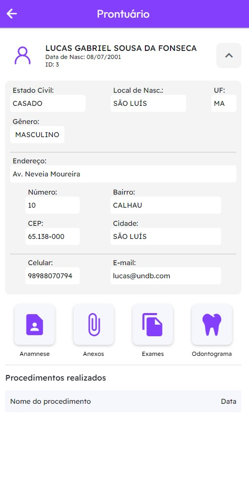
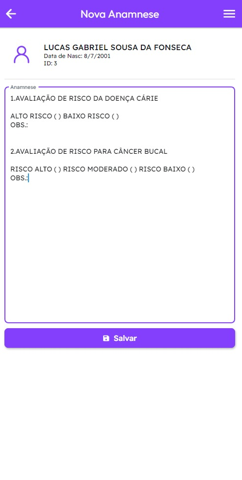
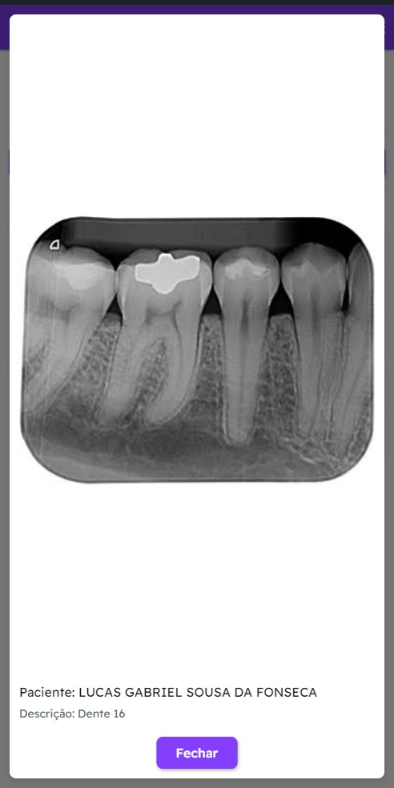

# Projeto Faciclin (Aplicativo de Odontologia)

## Página inicial

## Perfil do usuário

## Menu Prontuário

## Informações do Cliente

## Anamnese

## Nova Anamnese

## Anexos

## Visualização dos Anexos

## Adicionar Anexo

## Modelos Anamnese

A new Flutter project.

## Getting Started

FlutterFlow projects are built to run on the Flutter _stable_ release.
